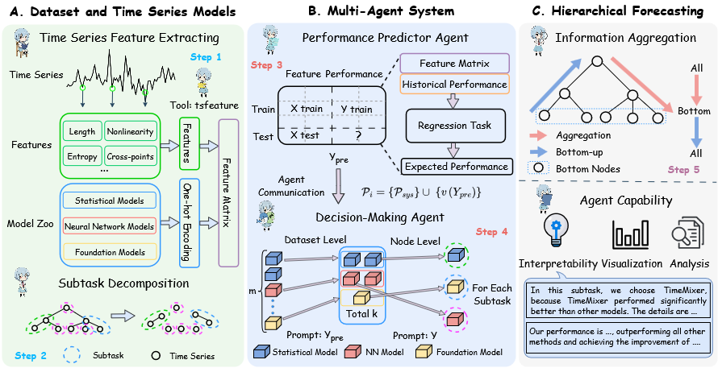

# Code for "TimeMAC: Collaborative Multi-Agent Forecasting for Hierarchical Time Series" 

"TimeMAC: Collaborative Multi-Agent Forecasting for Hierarchical Time Series" is under reviewing at ICML 2026.

## What is TimeMAC?

We propose TimeMAC, a multi-agent framework enabling collaborative cooperation for hierarchical forecasting. We introduce decomposition on hierarchy structures to obtain fine-grained sub-forecasting tasks. Building on this, we introduce a performance prediction agent to rapidly estimate model efficacy on unseen datasets, alongside a decision-making agent that selects the optimal models via a two-stage process. We also rethink previous forecasting reconciliation methods and propose hierarchical information aggregation. We conduct extensive experiments on mainstream hierarchical forecasting datasets. TimeMAC significantly outperforms existing methods, achieving 15\%–30\% improvement in many cases and surpassing the theoretical upper bound of existing agent performance.

## Method Overview



## Setup

All experiments run in Python 3.12 environment. You can install the dependency libraries as follows:

```
pip install -r requirements.txt
```

## Run the Code

All the methods compared in the paper can be run as follows. Our method is denoted as "TimeMAC".

```
python run_exp.py
```

where dataset is one of `{Tourismsmall, Tourismlarge, Traffic, Labour, Wiki, Amazon}`.

## Acknowledge
Special thanks to the following repositories for their invaluable code and prompt.
Our prompt and code are partially adapted from [TimeCopilot](https://github.com/TimeCopilot/timecopilot). Our model zoo is based on [Nixtla](https://github.com/nixtla).
